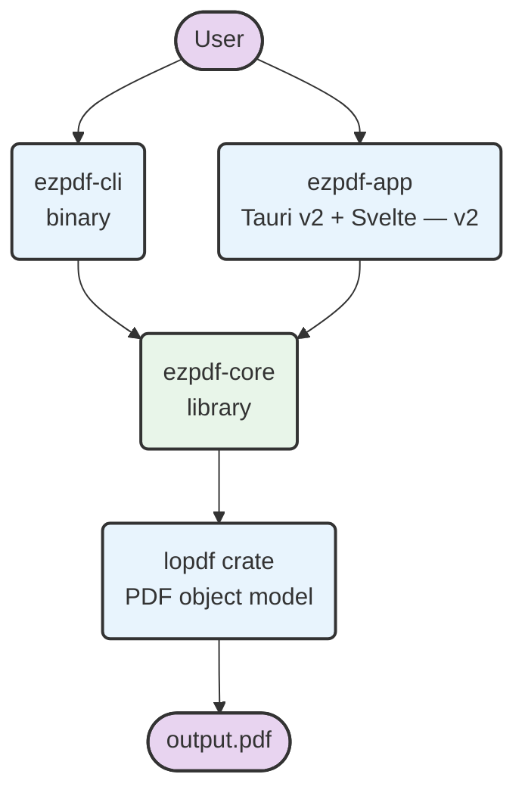
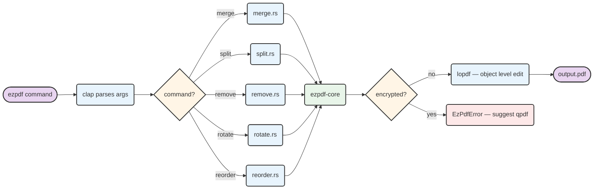
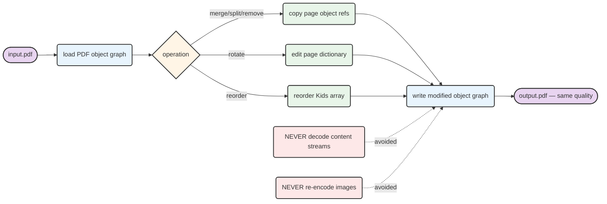

# ezpdf

A fast, lossless PDF manipulation CLI tool written in Rust. Merge, split, remove, rotate, and reorder pages without ever re-encoding content — what goes in comes out at exactly the same quality.

Built as a modern replacement for `pdftk`, with a developer-first experience: clean subcommands, intuitive flags, shell completions, and man pages.

---

## Features

| Command    | Description                                          |
|------------|------------------------------------------------------|
| `merge`    | Combine two or more PDFs into one                    |
| `split`    | Extract a page range or burst into individual pages  |
| `remove`   | Delete specific pages or ranges                      |
| `rotate`   | Rotate all or specific pages by 90/180/270°          |
| `reorder`  | Rearrange pages by specifying a new order            |

---

## Installation

```bash
# Homebrew (macOS / Linux)
brew install zhou-en/tap/ezpdf

# Cargo
cargo install ezpdf
```

---

## Usage

```bash
# Merge PDFs
ezpdf merge a.pdf b.pdf c.pdf -o combined.pdf

# Split — extract a range
ezpdf split report.pdf 1-10 -o part1.pdf

# Split — burst into individual pages
ezpdf split report.pdf --each -o ./pages/

# Remove pages
ezpdf remove report.pdf 3,5,7-9 -o cleaned.pdf

# Rotate all pages
ezpdf rotate report.pdf 90 -o rotated.pdf

# Rotate specific pages
ezpdf rotate report.pdf 90 --pages 1,3,5 -o rotated.pdf

# Reorder pages
ezpdf reorder report.pdf 3,1,2,4 -o reordered.pdf

# Shell completions
ezpdf completions zsh >> ~/.zshrc
```

Page ranges use `1-5,7,9-12` syntax consistently across all commands. Pages are 1-indexed.

---

## Architecture

### Workspace Structure

`ezpdf` is a Cargo workspace with a shared core library. All PDF logic lives in `ezpdf-core` — the CLI and the future desktop app are thin shells over it.



### Command Execution Flow

Every command follows the same path: CLI parses args → routes to core function → lossless PDF manipulation → file written.



### Lossless Quality Guarantee

`ezpdf` never re-renders pages. It works at the PDF object level — moving page dictionaries and their referenced content streams around without ever decoding them.



---

## Project Structure

```
ez-pdf/
├── ezpdf-core/               # Library — all PDF logic
│   ├── src/
│   │   ├── lib.rs
│   │   ├── merge.rs
│   │   ├── split.rs
│   │   ├── remove.rs
│   │   ├── rotate.rs
│   │   ├── reorder.rs
│   │   ├── page_range.rs     # "1-5,7,9-12" parser
│   │   └── error.rs
│   └── tests/
│       └── fixtures/         # sample PDFs for integration tests
├── ezpdf-cli/                # Binary — CLI (clap)
│   └── src/
│       ├── main.rs
│       └── commands/
├── ezpdf-app/                # Desktop app — Tauri v2 + Svelte (v2)
├── benches/                  # criterion benchmarks
├── docs/
│   ├── brainstorms/          # design decisions
│   └── plans/                # implementation plan
├── task_plan.md              # TDD task list (ralph loop)
├── PROMPT.md                 # autonomous loop prompt
└── ralph-loop.sh             # autonomous implementation loop
```

---

## Development

### Prerequisites

```bash
# Rust (stable)
curl --proto '=https' --tlsv1.2 -sSf https://sh.rustup.rs | sh

# Build & test
cargo build --workspace
cargo test --workspace
cargo clippy --workspace -- -D warnings
```

### Autonomous Implementation (Ralph Loop)

This project uses a [Ralph Loop](https://github.com/zhou-en/ez-pdf/blob/main/ralph-loop.sh) for autonomous TDD-driven implementation. Each task in `task_plan.md` follows a strict `[RED] → [GREEN] → [REFACTOR]` cycle.

```bash
# Start the loop (runs until all tasks complete)
./ralph-loop.sh

# Monitor progress in separate panes
tail -f ralph-loop.log
watch -n 5 git log --oneline -10
```

The loop stops automatically when a blocker is found, or outputs `EZPDF V1 COMPLETE` when all 10 phases are done.

---

## Roadmap

| Version | Scope |
|---------|-------|
| **v1.0** | merge, split, remove, rotate, reorder — CLI + Homebrew |
| **v1.1** | batch operations, `ezpdf info` command |
| **v2.0** | desktop app (Tauri v2 + Svelte), encrypted PDF support |

---

## License

MIT
