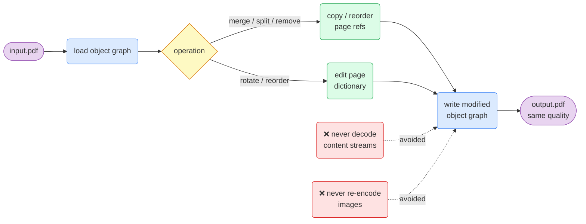
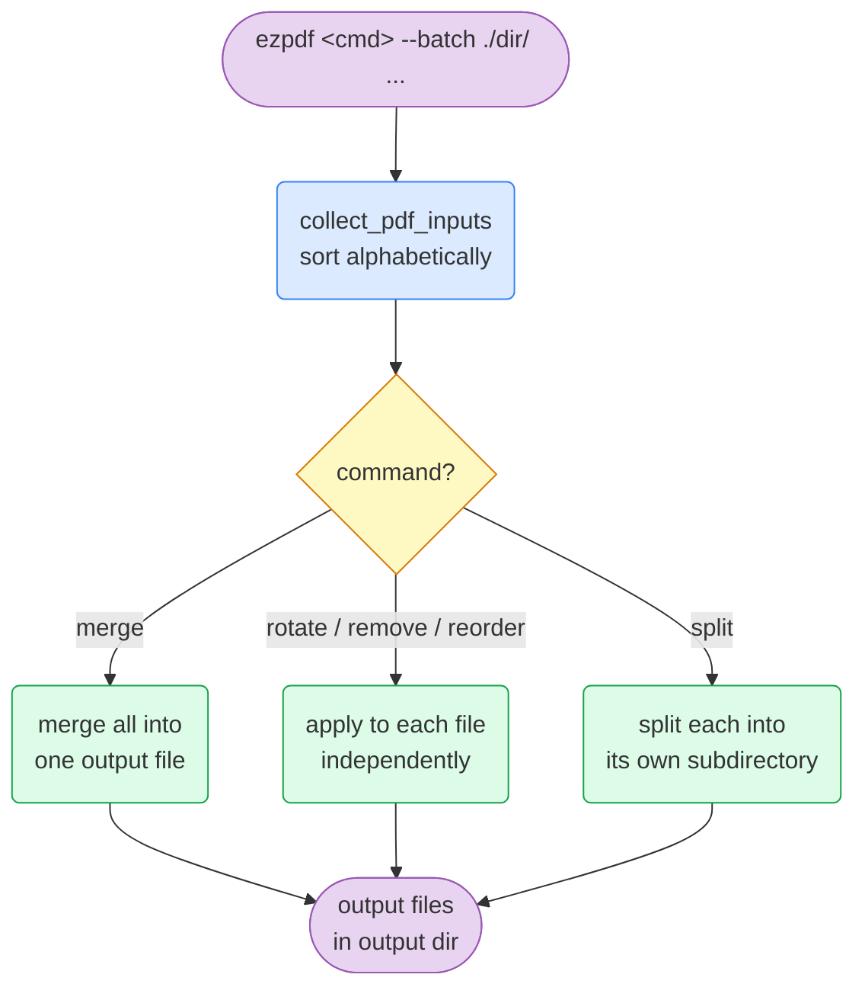
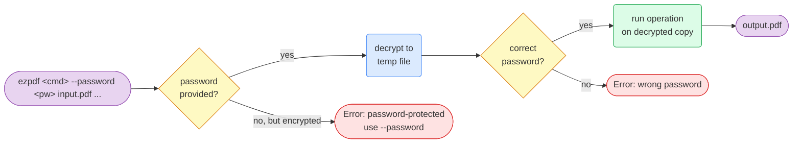

# ezpdf User Manual

`ezpdf` is a fast, lossless PDF manipulation tool for the command line. It merges, splits, removes, rotates, reorders, watermarks, and inspects PDFs — all without ever re-encoding page content.

---

## Table of Contents

1. [Installation](#installation)
2. [Core Concept: Lossless Editing](#core-concept-lossless-editing)
3. [Page Range Syntax](#page-range-syntax)
4. [Commands](#commands)
   - [merge](#merge)
   - [split](#split)
   - [remove](#remove)
   - [rotate](#rotate)
   - [reorder](#reorder)
   - [info](#info)
   - [meta](#meta)
   - [watermark](#watermark)
   - [bookmarks](#bookmarks)
   - [images](#images)
   - [optimize](#optimize)
   - [completions](#completions)
5. [Batch Operations](#batch-operations)
6. [Encrypted PDFs](#encrypted-pdfs)
7. [Common Workflows](#common-workflows)
8. [Error Reference](#error-reference)

---

## Installation

```bash
# macOS / Linux via Homebrew
brew install zhou-en/tap/ezpdf

# Via Cargo
cargo install ezpdf

# Verify
ezpdf --version
```

---

## Core Concept: Lossless Editing

`ezpdf` operates at the PDF object level. It moves page dictionaries and their referenced content streams around without ever decoding them. Images stay at their original resolution, fonts are untouched, and no re-rendering takes place.



---

## Page Range Syntax

Many commands accept a page range string. All pages are **1-indexed**.

| Format | Example | Pages selected |
|--------|---------|----------------|
| Single page | `3` | 3 |
| Range | `1-5` | 1 2 3 4 5 |
| Open-ended range | `3-` | 3 to last page |
| List | `1,3,5` | 1 3 5 |
| Combined | `1-3,5,7-9` | 1 2 3 5 7 8 9 |

**Rules:**
- `0` is invalid — pages start at `1`
- Range start must be ≤ end (`7-3` is an error)
- All page numbers must be within the document's page count

---

## Commands

### merge

Combine two or more PDFs into one, in the order given.

```
ezpdf merge <FILES>... -o <OUTPUT> [--batch] [--password <PW>] [-q]
```

```bash
# Merge two files
ezpdf merge a.pdf b.pdf -o combined.pdf

# Merge three files in order
ezpdf merge cover.pdf chapter1.pdf chapter2.pdf -o book.pdf

# Merge all PDFs in a directory
ezpdf merge --batch ./chapters/ -o book.pdf

# Merge password-protected files
ezpdf merge --password secret a.pdf b.pdf -o combined.pdf
```

**Output:** `Merged N files → combined.pdf`

---

### split

Extract a page range or burst a PDF into individual pages.

```
ezpdf split <INPUT> [RANGE] -o <OUTPUT> [--each] [--batch] [--password <PW>] [-q]
```

```bash
# Extract pages 1–5 into a new file
ezpdf split report.pdf 1-5 -o part1.pdf

# Extract a non-contiguous selection
ezpdf split report.pdf 1-3,7,10- -o selection.pdf

# Burst into individual pages (one file per page)
ezpdf split report.pdf --each -o ./pages/
# Creates: pages/page-01.pdf, page-02.pdf, ... (zero-padded)

# Burst each PDF in a directory into its own subdirectory
ezpdf split --batch ./pdfs/ -o ./pages/
```

**Output (range):** `Split pages 1-5 → part1.pdf`
**Output (burst):** `Split into individual pages → ./pages/`

---

### remove

Delete specific pages from a PDF.

```
ezpdf remove <INPUT> <PAGES> -o <OUTPUT> [--batch] [--password <PW>] [-q]
```

```bash
# Remove a single page
ezpdf remove report.pdf 3 -o output.pdf

# Remove multiple pages
ezpdf remove report.pdf 1,5,7-9 -o output.pdf

# Remove the cover page from every PDF in a directory
ezpdf remove --batch ./pdfs/ 1 -o ./trimmed/
```

**Output:** `Removed pages 1,5,7-9 → output.pdf`

> **Note:** Attempting to remove all pages returns an error.

---

### rotate

Rotate all or specific pages by a multiple of 90°.

```
ezpdf rotate <INPUT> <DEGREES> -o <OUTPUT> [--pages <RANGE>] [--batch] [--password <PW>] [-q]
```

```bash
# Rotate all pages 90° clockwise
ezpdf rotate scan.pdf 90 -o rotated.pdf

# Rotate 180° (upside down)
ezpdf rotate scan.pdf 180 -o flipped.pdf

# Rotate only pages 1 and 3
ezpdf rotate scan.pdf 90 --pages 1,3 -o rotated.pdf

# Counter-clockwise (negative degrees)
ezpdf rotate scan.pdf -90 -o rotated.pdf

# Batch: rotate all PDFs in a directory
ezpdf rotate --batch ./scans/ 90 -o ./rotated/
```

**Valid degrees:** any multiple of 90 (positive or negative).
**Output:** `Rotated 90° → rotated.pdf`

---

### reorder

Rearrange pages by specifying the new order as a comma-separated list of 1-indexed page numbers.

```
ezpdf reorder <INPUT> <ORDER> -o <OUTPUT> [--batch] [--password <PW>] [-q]
```

```bash
# Move page 3 to the front
ezpdf reorder report.pdf 3,1,2 -o reordered.pdf

# Reverse a 4-page document
ezpdf reorder doc.pdf 4,3,2,1 -o reversed.pdf

# Batch: apply same reorder to all PDFs in a directory
ezpdf reorder --batch ./pdfs/ 2,1 -o ./swapped/
```

**Rules:** Every page must appear exactly once. Duplicates and missing pages return an error.

**Output:** `Reordered → reordered.pdf`

---

### info

Inspect a PDF: page count, per-page dimensions, and document metadata.

```
ezpdf info <FILE> [--pages <RANGE>] [--json]
```

```bash
# Show full info
ezpdf info report.pdf

# Show dimensions for specific pages only
ezpdf info report.pdf --pages 1,3

# Machine-readable JSON output
ezpdf info report.pdf --json
```

**Human-readable output:**
```
File:  report.pdf
Pages: 10

Page   Width pt   Height pt
------ ---------- ----------
1      612.0      792.0      (Letter)
2      612.0      792.0      (Letter)
...

Title      Annual Report 2025
Author     Jane Doe
```

**JSON output:**
```json
{
  "page_count": 10,
  "dimensions": [[612.0, 792.0], ...],
  "title": "Annual Report 2025",
  "author": "Jane Doe",
  "subject": null,
  "keywords": null,
  "creator": null,
  "producer": null
}
```

Common paper sizes are detected automatically: **Letter** (612×792), **A4** (595×842), **Legal** (612×1008).

---

### meta

Read or write PDF document metadata (title, author, subject, keywords, creator, producer).

#### meta get

```
ezpdf meta get <FILE> [--json]
```

```bash
# Print all metadata fields
ezpdf meta get report.pdf

# JSON output (for scripting)
ezpdf meta get report.pdf --json
```

**Output:**
```
Title      Annual Report 2025
Author     Jane Doe
Subject    Finance
Keywords   annual, finance, 2025
```

#### meta set

```
ezpdf meta set <FILE> -o <OUTPUT> [--title] [--author] [--subject] [--keywords] [--creator] [--producer] [--clear-all] [-q]
```

```bash
# Set a single field
ezpdf meta set report.pdf --title "Q4 Report" -o output.pdf

# Set multiple fields at once
ezpdf meta set report.pdf --title "Q4 Report" --author "Jane" --keywords "finance, Q4" -o output.pdf

# Wipe all metadata, then set fresh
ezpdf meta set report.pdf --clear-all --title "Sanitized" -o output.pdf
```

**Output:** `Updated metadata → output.pdf`

---

### watermark

Stamp diagonal text onto pages.

```
ezpdf watermark <INPUT> <TEXT> -o <OUTPUT> [--opacity] [--font-size] [--color] [--pages] [-q]
```

```bash
# Basic watermark on all pages
ezpdf watermark report.pdf "CONFIDENTIAL" -o watermarked.pdf

# Custom opacity and size
ezpdf watermark report.pdf "DRAFT" --opacity 0.15 --font-size 60 -o draft.pdf

# Custom grey color (R,G,B each 0.0–1.0)
ezpdf watermark report.pdf "DRAFT" --color 0.7,0.7,0.7 -o draft.pdf

# Watermark only the first page
ezpdf watermark report.pdf "CONFIDENTIAL" --pages 1 -o watermarked.pdf
```

| Flag | Default | Description |
|------|---------|-------------|
| `--opacity` | `0.3` | 0.0 = invisible, 1.0 = solid |
| `--font-size` | `48` | Font size in points |
| `--color` | `0.5,0.5,0.5` | Grey; use `1,0,0` for red |
| `--pages` | all pages | Page range to watermark |

> **Note:** Watermarking modifies content streams. The lossless guarantee applies to other commands but not `watermark` — this is expected.

**Output:** `Watermarked 'CONFIDENTIAL' → watermarked.pdf`

---

### bookmarks

List or add entries to a PDF's outline (bookmarks panel).

```
ezpdf bookmarks list <FILE> [--json]
ezpdf bookmarks add <FILE> --title <TITLE> --page <PAGE> -o <OUTPUT> [-q]
```

```bash
# List all bookmarks
ezpdf bookmarks list report.pdf

# List as JSON
ezpdf bookmarks list report.pdf --json

# Add a bookmark pointing to page 5
ezpdf bookmarks add report.pdf --title "Chapter 2" --page 5 -o output.pdf

# Build up an outline step by step
ezpdf bookmarks add report.pdf --title "Introduction" --page 1 -o step1.pdf
ezpdf bookmarks add step1.pdf  --title "Methods"      --page 3 -o step2.pdf
ezpdf bookmarks add step2.pdf  --title "Results"      --page 8 -o final.pdf
```

**List output:**
```
Introduction (page 1)
Methods (page 3)
  Subsection A (page 4)
Results (page 8)
```

Indentation (2 spaces per level) reflects nesting depth.

**Add output:** `Added bookmark "Chapter 2" → output.pdf`

---

### images

Extract all embedded images from a PDF and save them to a directory.

```
ezpdf images <FILE> -o <OUTPUT_DIR> [-q]
```

```bash
# Extract images into ./images/
ezpdf images report.pdf -o ./images/

# Pipe count to a script
count=$(ezpdf images report.pdf -o ./images/ | grep -oP '\d+')
```

Images are named `page-{N}-image-{M}.jpg` (JPEG) or `page-{N}-image-{M}.png` (other formats). The output directory is created if it doesn't exist.

**Output:** `Extracted 7 images → ./images/`

---

### optimize

Remove unreferenced objects from a PDF to reduce file size.

```
ezpdf optimize <FILE> -o <OUTPUT> [--linearize] [-q]
```

```bash
# Compact a PDF by removing orphaned objects
ezpdf optimize bloated.pdf -o optimized.pdf

# Also linearize for fast web delivery (requires qpdf)
ezpdf optimize bloated.pdf --linearize -o optimized.pdf
```

**Output:** `Optimized → optimized.pdf (12 objects removed, 48320 bytes saved)`

> `--linearize` shells out to `qpdf --linearize`. If `qpdf` is not installed, a warning is printed and the optimize step runs without linearization.

---

### completions

Generate shell completion scripts.

```
ezpdf completions <SHELL>
```

```bash
# zsh
ezpdf completions zsh >> ~/.zshrc

# bash
ezpdf completions bash >> ~/.bashrc

# fish
ezpdf completions fish > ~/.config/fish/completions/ezpdf.fish
```

Supported shells: `bash`, `zsh`, `fish`, `powershell`, `elvish`.

---

## Batch Operations

Add `--batch` to process all `.pdf` files in a directory at once. Files are processed in alphabetical order.



```bash
# Rotate every PDF in ./scans/ and save to ./rotated/
ezpdf rotate --batch ./scans/ 90 -o ./rotated/

# Remove the first page from every PDF in ./raw/ → ./cleaned/
ezpdf remove --batch ./raw/ 1 -o ./cleaned/

# Merge all PDFs in ./chapters/ into one book
ezpdf merge --batch ./chapters/ -o book.pdf

# Reorder pages of every PDF in ./slides/ (e.g., swap first two pages)
ezpdf reorder --batch ./slides/ 2,1,3- -o ./reordered/

# Burst each PDF in a directory into its own subfolder
ezpdf split --batch ./reports/ --each -o ./pages/
```

The output directory is created automatically if it doesn't exist. Each output file keeps the same name as its input.

---

## Encrypted PDFs

Use `--password` or `--password-file` on any command.



```bash
# Inline password
ezpdf merge --password secret a.pdf b.pdf -o combined.pdf

# Password from file (useful in scripts; strips trailing newline)
echo "secret" > .pdf-password
ezpdf rotate --password-file .pdf-password scan.pdf 90 -o rotated.pdf

# Decrypt once with qpdf, then use ezpdf freely
qpdf --decrypt --password=secret input.pdf decrypted.pdf
ezpdf split decrypted.pdf 1-5 -o part.pdf
```

All five editing commands (`merge`, `split`, `remove`, `rotate`, `reorder`) accept `--password` and `--password-file`.

---

## Common Workflows

### Prepare a document for sharing

```bash
# Remove internal draft pages, rotate to correct orientation, stamp confidential
ezpdf remove draft.pdf 1,15 -o step1.pdf
ezpdf rotate step1.pdf 90 --pages 3,4 -o step2.pdf
ezpdf watermark step2.pdf "CONFIDENTIAL" --opacity 0.2 -o final.pdf
```

### Build a PDF from scanned images

```bash
# Each scan is a single-page PDF; merge in order, then add bookmarks
ezpdf merge --batch ./scans/ -o book.pdf
ezpdf bookmarks add book.pdf --title "Chapter 1" --page 1  -o step1.pdf
ezpdf bookmarks add step1.pdf --title "Chapter 2" --page 12 -o step2.pdf
```

### Extract and archive images from a batch of reports

```bash
for pdf in ./reports/*.pdf; do
    name=$(basename "$pdf" .pdf)
    ezpdf images "$pdf" -o "./images/$name/"
done
```

### Reduce file size before emailing

```bash
ezpdf optimize large.pdf -o smaller.pdf
# With qpdf installed, also linearize for fast browser preview:
ezpdf optimize large.pdf --linearize -o web-ready.pdf
```

### Inspect before processing

```bash
# Check page count and size before splitting
ezpdf info report.pdf

# Check metadata before sending externally
ezpdf meta get report.pdf

# Strip internal metadata
ezpdf meta set report.pdf --clear-all -o sanitized.pdf
```

### Script-friendly JSON output

```bash
# Get page count in a shell script
pages=$(ezpdf info report.pdf --json | jq '.page_count')
echo "Document has $pages pages"

# Get all metadata as JSON
ezpdf meta get report.pdf --json | jq '.author'

# List bookmarks as JSON
ezpdf bookmarks list report.pdf --json | jq '.[].title'
```

---

## Error Reference

| Error | Cause | Fix |
|-------|-------|-----|
| `page N is out of range (document has M pages)` | Page number exceeds the document's page count | Check page count with `ezpdf info` first |
| `invalid page range syntax 'X': hint` | Malformed range string | See [Page Range Syntax](#page-range-syntax) |
| `PDF is password-protected` | Encrypted PDF opened without a password | Add `--password <pw>` or `--password-file` |
| `wrong PDF password` | Incorrect password provided | Check the password and retry |
| `cannot remove all N pages` | The pages to remove covers every page | Keep at least one page |
| `I/O error: No such file or directory` | Input file path is wrong | Check the path; use quotes for paths with spaces |
| `Error: ` (generic, to stderr) | Any unrecoverable error | Full message follows the prefix; exit code is `1` |

---

## Global Flags

| Flag | Commands | Description |
|------|----------|-------------|
| `-q, --quiet` | all editing commands | Suppress success messages (errors still shown) |
| `--password <PW>` | merge, split, remove, rotate, reorder | Password for encrypted input PDFs |
| `--password-file <FILE>` | merge, split, remove, rotate, reorder | Read password from a file |
| `--batch` | merge, split, remove, rotate, reorder | Process a directory of PDFs |
| `--json` | info, meta get, bookmarks list | Machine-readable JSON output |
| `--pages <RANGE>` | rotate, info, watermark | Apply to specific pages only |
| `-V, --version` | root | Print version and exit |
| `-h, --help` | any | Print help for that command |

---

## Performance Notes

Benchmarks on Apple M3 (release build, `cargo bench`):

| Operation | Time |
|-----------|------|
| Merge 5 × 10-page PDFs | ~10 ms |
| Remove half of 50-page PDF | ~8 ms |
| Rotate all pages of 50-page PDF | ~8 ms |
| Burst 50-page PDF into pages | ~333 ms (I/O bound) |

Merge uses parallel document loading (`rayon`) — speedup is most noticeable with 5+ large inputs. All other operations are single-threaded.
